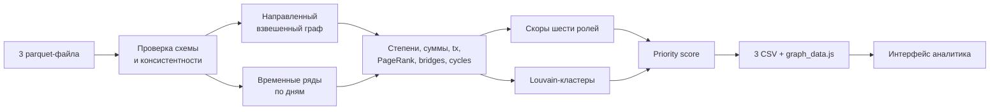

# Freedom AML — граф денег

Локальный объяснимый анализ четырёхколенного графа внутрибанковских переводов. Пайплайн назначает роль каждому из 2 248 клиентов, выделяет сообщества и отвечает на рабочий вопрос AML-аналитика: кого проверять первым и почему.

## Один запуск

Положить три исходных parquet-файла в `data/` и выполнить:

```powershell
python run.py
```

Команда устанавливает зависимости, пересчитывает все обязательные выгрузки и запускает механическую проверку результата. Повторный запуск без установки зависимостей:

```powershell
python starter.py --data ./data --out ./out
python validate.py
```

Для демонстрации интерфейса:

```powershell
python -m http.server 8000
```

Открыть <http://localhost:8000/ui/>. Расчёт и интерфейс не требуют API-ключа, GPU или доступа в интернет.

## Обязательные результаты

- `out/nodes_roles.csv` — 2 248 строк: `gid`, `role`, `role_score`, `cluster_id`, `priority_score`, `evidence` и дополнительные объясняющие признаки;
- `out/clusters.csv` — строка на кластер: размер, число seed, внутренний оборот, лидеры и гипотеза назначения;
- `out/top_nodes.csv` — 30 узлов по убыванию приоритета с числовым обоснованием;
- `out/graph_data.js` — все 2 248 узлов и 3 119 рёбер для поиска и построения связей произвольного GID.

На предоставленном датасете полный пересчёт занимает около трёх секунд после установки библиотек. Алгоритм детерминирован (`seed=42`).

## Схема решения



Направление, суммы и количество переводов сохраняются при расчёте ролей. Ненаправленная проекция применяется только для Louvain и поиска articulation points.

## Признаки и нормализация

`P(x)` ниже — percentile rank признака среди всех 2 248 узлов от 0 до 1. Такая нормализация не позволяет одному экстремально крупному переводу задавить остальные сигналы.

Основные признаки:

- `in_deg`, `out_deg` — уникальные плательщики и получатели;
- `in_kzt`, `out_kzt` — наблюдаемые суммы;
- `in_tx`, `out_tx` — количество отдельных транзакций;
- `same_day_ratio` — доля наблюдаемого входа, для которой в тот же день есть исходящий объём; значение ограничено единицей;
- `flow_balance = min(in_kzt, out_kzt) / max(in_kzt, out_kzt)`;
- `upstream_seed_count` — число seed-ветвей, достигающих узла по рёбрам с возрастающей глубиной;
- `betweenness` — приближённое посредничество на направленном графе с детерминированной выборкой до 300 узлов;
- `cross_cluster_count` — число соседних Louvain-сообществ;
- `pagerank` — PageRank, взвешенный по `sum_kzt`;
- `in_cycle`, встречные рёбра и articulation point — признаки возвратных потоков и структурной связности.

## Формальные правила ролей

Для каждой допустимой роли считается скор 0–1. Основная роль — максимальный допустимый скор, `role_score` — его значение.

### `consolidator`

Кандидат должен быть не seed и иметь не менее трёх наблюдаемых плательщиков.

```text
0.29·P(in_deg) + 0.20·P(in_kzt) + 0.16·P(in_tx)
+ 0.12·(1-P(out_deg)) + 0.13·P(upstream_seed_count) + 0.10·P(pagerank)
```

Высокий скор означает много независимых входов и сравнительно мало направлений выхода.

### `distributor`

Кандидат должен иметь минимум трёх получателей.

```text
0.31·P(out_deg) + 0.22·P(out_kzt) + 0.17·P(out_tx)
+ 0.10·(1-out_concentration) + 0.10·P(betweenness)
+ 0.10·P(upstream_seed_count)
```

Низкая концентрация означает, что исходящая сумма распределена между несколькими получателями, а не одним каналом.

### `transit`

Кандидат должен иметь вход и выход и не быть seed. Seed исключён, потому что его входящие данные системно неполны.

```text
0.30·same_day_ratio + 0.24·flow_balance
+ 0.15·min(both_direction_days,3)/3 + 0.13·P(betweenness)
+ 0.10·P(active_days) + 0.08·(1-|P(in_deg)-P(out_deg)|)
```

Точность дат — один день, поэтому это признак транзита, а не утверждение о причинной связи переводов.

### `terminal`

Сначала считается материальность входа:

```text
M = 0.38·P(in_kzt) + 0.28·P(in_tx) + 0.20·P(in_deg) + 0.14·P(active_days)
```

- наблюдаемый сток на depth 0–3: `0.48 + 0.52·M`;
- сток на depth 4: `0.20 + 0.45·M` и наблюдаемость 0.45.

Поэтому одноразовый получатель на четвёртом колене обычно остаётся `peripheral`, а материальный повторяющийся поток может стать только вероятностным `terminal`. В `evidence` прямо указывается обрыв выборки.

### `coordinator`

Нужны одновременно вход и выход, а также хотя бы один структурный признак: две seed-ветви, articulation point или связь минимум с двумя кластерами.

```text
0.27·P(betweenness) + 0.23·P(upstream_seed_count)
+ 0.18·P(cross_cluster_count) + 0.12·P(pagerank)
+ 0.10·P(in_deg) + 0.10·P(out_deg) + 0.08·is_articulation
```

Скор ограничивается единицей. Роль означает кандидата на координирующую функцию и требует проверки аналитиком.

### `peripheral`

```text
0.30 + 0.55·(1-max(P(in_tx),P(out_tx))) + 0.15·I(total_degree≤1)
```

Изолированные seed получают `peripheral` с `role_score=1`: данных достаточно, чтобы уверенно сказать лишь об отсутствии наблюдаемой роли.

## Приоритет проверки

Приоритет отделён от уверенности в роли. Сначала считается:

```text
raw = 0.24·role_risk + 0.14·role_score + 0.22·activity
    + 0.20·structural + 0.10·temporal_or_cycle + 0.10·observability
priority_score = P(raw)
```

Где `activity` — максимум percentile сумм и количества операций, `structural` — максимум PageRank, betweenness и числа seed-ветвей. Веса ролей: coordinator 1.00, consolidator 0.92, distributor 0.86, transit 0.72, terminal 0.55, peripheral 0.08. Изолированные узлы получают нулевой raw score.

`evidence` формируется детерминированно, содержит фактические степени, суммы, tx и/или временные признаки и не превышает 200 символов.

## Кластеризация

Louvain запускается с фиксированным seed на ненаправленной проекции. Сила связи:

```text
log(1 + sum_kzt) · (1 + 0.15·log(1 + n_tx))
```

Так крупная сумма учитывается, но не поглощает структуру сети. Изоляты получают собственные кластеры. `sum_kzt_internal` считается только по рёбрам, у которых обе вершины находятся внутри кластера. Гипотеза строится из преобладающих ролей и формулируется как направление проверки.

## Ограничения и осторожность выводов

- У всех узлов возможны невидимые входящие потоки; у seed проблема особенно сильна. `out_kzt / in_kzt > 1` не является самостоятельной аномалией.
- 444 узла depth=4 цензурированы обходом. Отсутствие исходящих не доказывает оседание денег.
- Переводы ниже 5 000 KZT, другие банки, наличные, остатки до июля и операции вне периода не наблюдаются.
- `depth` — глубина обнаружения, а не уровень в преступной иерархии.
- Нет разметки ролей и атрибутов клиента. Результат — объяснимая гипотеза для AML-проверки, а не вывод о виновности.
- В графе 16 компонент без изолятов и ещё 19 изолированных seed; они не объединяются искусственно.

## Интерфейс

Доступны граф, таблица всех клиентов и карточки кластеров. Поиск сохраняет точность 18-значных GID. Для любого узла интерфейс строит читаемый ego-граф: до 24 крупнейших прямых связей и до 20 соседних узлов. Все исходные рёбра остаются доступны в `graph_data.js`; ограничивается только число одновременно нарисованных элементов.

Карточка показывает роль, приоритет, потоки, число контрагентов, кластер, глубину и числовое обоснование. Направление денег показано стрелками. CSV выгружаются из интерфейса.

## Масштабирование до миллиона узлов

Текущая реализация NetworkX рассчитана на хакатонный объём. Для графа порядка миллиона узлов:

- хранить признаки и рёбра в партиционированном Parquet;
- перейти на igraph/graph-tool или распределённый GraphFrames/Neo4j GDS;
- использовать приближённые PageRank и betweenness, Leiden/Louvain по компонентам;
- считать роли векторизованно по батчам, а временные признаки — SQL/Polars/Spark;
- отдавать интерфейсу ego-граф выбранного узла через API, не весь граф целиком;
- выполнять инкрементальный пересчёт затронутых компонент при поступлении нового периода.

Формулы ролей и формат evidence при этом сохраняются, поэтому объяснения остаются сопоставимыми.
