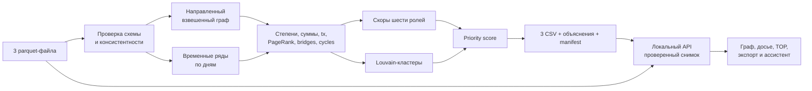

# Freedom AML — граф денег

Локальный объяснимый анализ четырёхколенного графа внутрибанковских переводов. Пайплайн назначает роль каждому из 2 248 клиентов, выделяет сообщества и отвечает на рабочий вопрос AML-аналитика: кого проверять первым и почему.

## Один запуск

Проверенное окружение: Python 3.14, Windows x64. Положить три исходных parquet-файла в `data/` и выполнить из корня проекта:

```powershell
python run.py
```

Команда устанавливает зафиксированные зависимости из `requirements.lock.txt`, пересчитывает все обязательные выгрузки и запускает механическую проверку результата. Первая установка библиотек требует сети; дальнейший расчёт — нет. Рекомендуется отдельное виртуальное окружение. Повторный запуск без установки зависимостей:

```powershell
python starter.py --data ./data --out ./out
python validate.py
```

Для интерфейса с backend, загрузкой данных и ассистентом:

```powershell
python server.py
```

Открыть <http://127.0.0.1:8000/ui/>. Или одной командой установить зависимости, сформировать файлы и запустить приложение: `python run.py --serve`. При готовом окружении: `python run.py --serve --skip-install`. Остановить сервер: Ctrl+C. Обычный `http.server` больше не подходит: интерфейс использует API.

`run.py --serve` считает данные **один раз**, затем сервер использует `out/`. `python server.py` сначала обновляет `out/`; `python server.py --use-prebuilt` только проверяет уже готовые результаты. `out/manifest.json` связывает SHA-256 исходных файлов, аналитического кода и результатов: изменённый или устаревший расчёт нельзя открыть как актуальный. В браузере вводить CSV не нужно. Исходный граф берётся из `data/`, роли и приоритеты — из `out/`. После загрузки новых Parquet через UI активной становится отдельная проверенная папка `.runtime/datasets/<version>/out/`; скачивание CSV всегда относится к активному снимку.

Расчёт, загрузка и локальные сценарии ассистента работают без API-ключа, GPU и интернета. OpenAI — отдельная необязательная функция. Сервер доступен только на loopback: это локальный прототип, не многопользовательское банковское развёртывание.

### Подключение OpenAI

Задать `OPENAI_API_KEY` в окружении **процесса сервера** и перезапустить сервер. В PowerShell ключ можно ввести скрыто, без записи значения в историю команд:

```powershell
$amlSecret = Read-Host 'OpenAI API key' -AsSecureString
$env:OPENAI_API_KEY = [System.Net.NetworkCredential]::new('', $amlSecret).Password
$env:OPENAI_MODEL = 'gpt-4.1-mini'
.\.venv\Scripts\python.exe server.py
```

Модель можно заменить через `OPENAI_MODEL` на доступную вашему проекту с поддержкой Responses/function calling. `.env.example` — только памятка: `.env` автоматически не загружается. Ключ не должен попадать в UI, git или чат. Если порт 8000 занят, сначала остановите прежний процесс либо используйте `--port 8001`.

В интерфейсе честно различаются «OpenAI · настроен» (наличие ключа, не проверка доступа), «OpenAI · проверенные расчёты» (успешный вызов) и «Локальный разбор · без LLM». При таймауте/ошибке API отображается предупреждение и используется локальный сценарий. Live-вызов OpenAI требует действующего ключа и тарифицируется провайдером; тесты его не вызывают.

Модель выбирает строго типизированный `query_graph` через Responses API. Исполнение — только белый список чтения: обзор, профиль, TOP/роль, кластер, направленный путь, общие прямые получатели, дневная активность, контрагенты, ограничения. Произвольный код, SQL, запись данных и действия с клиентами недоступны. GID модели сверяются с вопросом/выбранным клиентом и текущим датасетом. Числа и финальный текст возвращает Python, а не свободная генерация. Это ограниченный query-agent, не автономный расследователь. Каждый вопрос независим; история показана в UI, но не отправляется модели.

В OpenAI передаются **вопрос и выбранный GID**; сами Parquet и полный граф не передаются. Вопрос также может содержать финансовые сведения — не вводите данные, передачу которых ваша организация не разрешает. Используется `store=false`; это не обещание нулевого хранения данных провайдером.

### Новые данные и непрерывная работа

Кнопка «Загрузить данные» принимает три файла в схеме ТЗ. Период, объём, количество узлов и транзакций берутся из файлов, не зашиты в интерфейс. Есть проверка типов, пропусков, уникальности, GID, положительных сумм, допустимой глубины, согласованности пар/сумм/количества операций. Даты имеют дневную точность. Изолированные узлы и пустой список переводов допустимы, пустой `nodes` — нет.

Лимиты локальной версии: 25 МБ файлов суммарно; 10 000 узлов; 100 000 рёбер; 500 000 транзакций; 128 МБ распакованного Parquet на файл; 240 секунд на расчёт. Лимиты защищают рабочую станцию, но не являются обещанием скорости для любой структуры графа. Больше — отдельный масштабируемый backend.

Пересчёт идёт в отдельном процессе. Пока он работает, предыдущий граф и ассистент доступны. Только после валидации результатов атомарно переключается целый снимок данных; при ошибке предыдущий снимок сохраняется. Один импорт одновременно, до двух запросов ассистента одновременно. UI проверяет версию раз в 4 секунды в активной вкладке, сбрасывает старую беседу при смене данных и не отображает запоздалые ответы предыдущего снимка. CSV привязаны к версии: устаревшая ссылка вернёт 409 вместо выгрузки другого датасета.

Загруженные файлы и результаты хранятся локально в `.runtime/datasets/<version>/`, активный снимок восстанавливается при перезапуске. «Вернуть исходные данные» переключает на `data/`, не удаляет загруженные файлы. Автоочистки нет: папка может расти. `.runtime` исключён из git, но не зашифрован; для реальных банковских данных нужны отдельные контроль доступа и политика хранения. Сервис работает, пока запущен Python; автозапуск после перезагрузки ОС не настроен.

### Проверки

```powershell
python -m unittest discover -s tests -v
python validate.py --expected-nodes 2248
python verify_mvp.py
# Дополнительно, при запущенном сервере и исходном датасете:
python verify_mvp.py --server http://127.0.0.1:8000
```

Тесты покрывают другой период/размер сети, 18-значные GID, одиночный изолят и пустые транзакции, повреждённые файлы, неверные типы/суммы, сценарии ассистента, таймаут и неподтверждённые GID от модели, фоновый импорт, конкурирующий импорт, сохранение предыдущего снимка, восстановление после перезапуска, устаревший экспорт и запрет cross-origin записи. OpenAI мокируется: реальную доступность модели эти тесты не подтверждают.

Дополнительные тесты сверяют слагаемые роли и приоритета с CSV, проверяют FIFO без повторного использования объёмов, границу месяцев, истечение двухдневного окна, направленный seed-путь, воспроизводимость и неизменяемые выгрузки активного снимка. `verify_mvp.py` проверяет объяснения **всех** узлов, а с `--server` — также побайтовое совпадение трёх скачиваемых CSV с `out/` и реальные досье API. Итоги последнего прогона — в [VERIFICATION.md](VERIFICATION.md), сценарий выступления — в [DEMO.md](DEMO.md).

## Обязательные результаты

- `out/nodes_roles.csv` — 2 248 строк: `gid`, `role`, `role_score`, `cluster_id`, `priority_score`, `evidence` и дополнительные объясняющие признаки;
- `out/clusters.csv` — строка на кластер: размер, число seed, внутренний оборот, лидеры и гипотеза назначения;
- `out/top_nodes.csv` — 30 узлов по убыванию приоритета с числовым обоснованием;
- `out/graph_data.js` — все 2 248 узлов и 3 119 рёбер для поиска и построения связей произвольного GID.
- `out/analysis.json` — дополнительные объяснения, альтернативные роли, временные совпадения и чувствительность рейтинга; не меняет обязательную схему CSV.
- `out/manifest.json` — контрольные суммы и измеренное время аналитического пайплайна без установки зависимостей.

На предоставленном датасете полный пересчёт занимает около трёх секунд после установки библиотек. Алгоритм детерминирован (`seed=42`).

## Схема решения



Направление, суммы и количество переводов сохраняются при расчёте ролей. Ненаправленная проекция применяется только для Louvain и поиска articulation points.

## Признаки и нормализация

`P(x)` ниже — percentile rank признака среди всех 2 248 узлов от 0 до 1. Такая нормализация не позволяет одному экстремально крупному переводу задавить остальные сигналы.

Основные признаки:

- `in_deg`, `out_deg` — уникальные плательщики и получатели;
- `in_kzt`, `out_kzt` — наблюдаемые суммы;
- `in_tx`, `out_tx` — количество отдельных транзакций;
- `same_day_ratio` — доля наблюдаемого входа, для которой в тот же день есть исходящий объём; значение ограничено единицей;
- `flow_balance = min(in_kzt, out_kzt) / max(in_kzt, out_kzt)`;
- `upstream_seed_count` — число seed-ветвей, достигающих узла по рёбрам с возрастающей глубиной;
- `betweenness` — приближённое посредничество на направленном графе с детерминированной выборкой до 300 узлов;
- `cross_cluster_count` — число соседних Louvain-сообществ;
- `pagerank` — PageRank, взвешенный по `sum_kzt`;
- `in_cycle`, встречные рёбра и articulation point — признаки возвратных потоков и структурной связности.

## Формальные правила ролей

Для каждой допустимой роли считается скор 0–1. Основная роль — максимальный допустимый скор, `role_score` — его значение.

### `consolidator`

Кандидат должен быть не seed и иметь не менее трёх наблюдаемых плательщиков.

```text
0.29·P(in_deg) + 0.20·P(in_kzt) + 0.16·P(in_tx)
+ 0.12·(1-P(out_deg)) + 0.13·P(upstream_seed_count) + 0.10·P(pagerank)
```

Высокий скор означает много независимых входов и сравнительно мало направлений выхода.

### `distributor`

Кандидат должен иметь минимум трёх получателей.

```text
0.31·P(out_deg) + 0.22·P(out_kzt) + 0.17·P(out_tx)
+ 0.10·(1-out_concentration) + 0.10·P(betweenness)
+ 0.10·P(upstream_seed_count)
```

Низкая концентрация означает, что исходящая сумма распределена между несколькими получателями, а не одним каналом.

### `transit`

Кандидат должен иметь вход и выход и не быть seed. Seed исключён, потому что его входящие данные системно неполны.

```text
0.30·same_day_ratio + 0.24·flow_balance
+ 0.15·min(both_direction_days,3)/3 + 0.13·P(betweenness)
+ 0.10·P(active_days) + 0.08·(1-|P(in_deg)-P(out_deg)|)
```

Точность дат — один день, поэтому это признак транзита, а не утверждение о причинной связи переводов.

### `terminal`

Сначала считается материальность входа:

```text
M = 0.38·P(in_kzt) + 0.28·P(in_tx) + 0.20·P(in_deg) + 0.14·P(active_days)
```

- наблюдаемый сток на depth 0–3: `0.48 + 0.52·M`;
- сток на depth 4: `0.20 + 0.45·M` и наблюдаемость 0.45.

Поэтому одноразовый получатель на четвёртом колене обычно остаётся `peripheral`, а материальный повторяющийся поток может стать только гипотезой `terminal` с пониженным эвристическим скором, не оценкой вероятности. В `evidence` прямо указывается обрыв выборки.

### `coordinator`

Нужны одновременно вход и выход, а также хотя бы один структурный признак: две seed-ветви, articulation point или связь минимум с двумя кластерами.

```text
0.27·P(betweenness) + 0.23·P(upstream_seed_count)
+ 0.18·P(cross_cluster_count) + 0.12·P(pagerank)
+ 0.10·P(in_deg) + 0.10·P(out_deg) + 0.08·is_articulation
```

Скор ограничивается единицей. Роль означает кандидата на координирующую функцию и требует проверки аналитиком.

### `peripheral`

```text
0.30 + 0.55·(1-max(P(in_tx),P(out_tx))) + 0.15·I(total_degree≤1)
```

Изолированные seed получают `peripheral` с `role_score=1`: данных достаточно, чтобы уверенно сказать лишь об отсутствии наблюдаемой роли.

## Приоритет проверки

Приоритет отделён от уверенности в роли. Сначала считается:

```text
raw = 0.24·role_risk + 0.14·role_score + 0.22·activity
    + 0.20·structural + 0.10·temporal_or_cycle + 0.10·observability
priority_score = P(raw)
```

Где `activity` — максимум percentile сумм и количества операций, `structural` — максимум PageRank, betweenness и числа seed-ветвей. Веса ролей: coordinator 1.00, consolidator 0.92, distributor 0.86, transit 0.72, terminal 0.55, peripheral 0.08. Изолированные узлы получают нулевые raw score и priority_score.

`evidence` формируется детерминированно, содержит фактические степени, суммы, tx и/или временные признаки и не превышает 200 символов.

## Кластеризация

Louvain запускается с фиксированным seed на ненаправленной проекции. Сила связи:

```text
log(1 + sum_kzt) · (1 + 0.15·log(1 + n_tx))
```

Так крупная сумма учитывается, но не поглощает структуру сети. Изоляты получают собственные кластеры. `sum_kzt_internal` считается только по рёбрам, у которых обе вершины находятся внутри кластера. Гипотеза строится из преобладающих ролей и формулируется как направление проверки.

## Ограничения и осторожность выводов

- У всех узлов возможны невидимые входящие потоки; у seed проблема особенно сильна. `out_kzt / in_kzt > 1` не является самостоятельной аномалией.
- 444 узла depth=4 цензурированы обходом. Отсутствие исходящих не доказывает оседание денег.
- Переводы ниже 5 000 KZT, другие банки, наличные, остатки до июля и операции вне периода не наблюдаются.
- `depth` — глубина обнаружения, а не уровень в преступной иерархии.
- Нет разметки ролей и атрибутов клиента. Результат — объяснимая гипотеза для AML-проверки, а не вывод о виновности.
- В графе 16 компонент без изолятов и ещё 19 изолированных seed; они не объединяются искусственно.

## Интерфейс

Доступны граф, таблица всех клиентов, карточки кластеров и экран ассистента. Поиск сохраняет точность 18-значных GID. Для любого узла интерфейс строит читаемый ego-граф: до 24 крупнейших прямых контрагентов и до 20 соседних узлов. Полный снимок узлов/рёбер отдаётся `/api/state`; ограничивается число одновременно нарисованных элементов. Все прямые связи и дни доступны через `/api/node/<gid>`. На карте явно указано, сколько контрагентов показано. Контрагенты ассистента — TOP по сумме, а не полный список всех переводов.

Карточка показывает роль, приоритет, потоки, число контрагентов, кластер, глубину и числовое обоснование. Направление денег показано стрелками. CSV выгружаются из интерфейса.

Переключатель «Цвет узлов» меняет окраску карты по ролям или кластерам. В режиме кластеров легенда перечисляет только сообщества видимого фрагмента; номер кластера также доступен в подсказке узла и досье. Фильтр по роли работает в обоих режимах.

### Проверяемое досье

- «Роль и признаки»: фактические числа, вклады в выбранную роль, все шесть альтернатив с условиями допустимости, отличие от второго места и следующий шаг проверки. Формулы расчёта и объяснения используют один модуль `role_model.py`, а не два расходящихся набора правил. При разнице меньше 5 п.п. UI явно отмечает близость гипотез. В сворачиваемом блоке показаны все шесть вкладов в приоритет.
- «Движение по дням»: вход/выход по активным дням и сопоставление дневных объёмов с задержкой 1–2 календарных дня. FIFO расходует каждый входящий и исходящий объём в этом расчёте не более одного раза; вход текущего дня добавляется только после сопоставления выхода, истёкшие объёмы исключаются. Это дополнительный описательный признак, **не доказанная трассировка денег** и не новое правило роли. У seed отдельно отмечается неполнота входа. Внутридневной порядок неизвестен.
- «Цепочка переводов» / «Путь от seed»: один кратчайший направленный путь длиной до четырёх рёбер, суммы и число операций за период. Поиск multi-source BFS идёт по полному наблюдаемому графу. Это не сумма, которая прошла сквозь всю цепочку, и не хронологическая последовательность. При нескольких равных путях используется стабильный порядок GID. Seed имеет путь длины 0; недостижимый узел получает явное сообщение.

### Чувствительность рейтинга

По очереди изменяем каждый из шести весов приоритета на −20% и +20%, после чего нормируем сумму весов. Получаем 12 сценариев, сравниваем состав TOP-20 с базовым и диапазон мест каждого клиента. На исходной выборке минимальное пересечение — **17 из 20**. Роли, граф и признаки фиксированы. Эта проверка не измеряет accuracy, не даёт доверительный интервал и не заменяет стресс-тест удаления узлов: последнее остаётся опциональным развитием.

## Масштабирование до миллиона узлов

Текущая реализация NetworkX рассчитана на хакатонный объём. Для графа порядка миллиона узлов:

- хранить признаки и рёбра в партиционированном Parquet;
- перейти на igraph/graph-tool или распределённый GraphFrames/Neo4j GDS;
- использовать приближённые PageRank и betweenness, Leiden/Louvain по компонентам;
- считать роли векторизованно по батчам, а временные признаки — SQL/Polars/Spark;
- отдавать интерфейсу ego-граф выбранного узла через API, не весь граф целиком;
- выполнять инкрементальный пересчёт затронутых компонент при поступлении нового периода.

Формулы ролей и формат evidence при этом сохраняются, поэтому объяснения остаются сопоставимыми.
